# Yes Steve Model 分析

## 摘要

本文以YSM 2.6.4 (Forge,Minecraft 1.20.1)为主要研究对象，围绕新版YSM的加密体系、序列化协议、几何反推与网络通讯四条线索展开系统逆向分析。研究素材包括：从客户端导出的加密模型样本、明文模型工程、解密解压链路各阶段的中间数据、Native DLL。

研究表明，新版YSM已不再沿用旧版Java层的AES-CBC方案，而是在Native层构建了由魔改CityHash64、参数链式更新的 XChaCha20、MT19937_64流密钥异或、魔改Zstd组成的多级保护链。其解压结果亦非任何已知格式，而是面向运行时对象系统的紧凑序列化流，版本号将其分为三个互不兼容的协议族。在最新一代格式中，模型工程被预渲染为纯几何顶点，工程层的origin、size、pivot、rotation与各面 UV 框被完全擦除，这也是还原到工程的最大挑战。

本文给出了一套针对该格式的完整还原方案。在解密层，通过动态调试穿透VMProtect、对照官方实现还原魔改CityHash与魔改Zstd的常量与控制流。在反序列化层，通过样本差分与版本对照，梳理出三代格式各自的对象骨架与字段阈值。在反渲染层，基于Blockbench立方体的特性，设计了完整的反渲染算法。在网络协议层，通过对Custom Payload通道的握手分析，还原了其数据包的用途，模型传输和加密的过程。本文同时回顾了V1 / V2历史格式的加密结构，以补完YSM三代加密的进化史。

相较于现有依赖启发式字符串搜索、仅能解密单一格式的开源项目，本工作从加密算法、序列化协议、几何还原与网络通讯四个维度建立了完整的技术图景，验证了"客户端必须能解密"这一根本约束下，任何客户端侧的加密方案最终都可被穿透。本文可为Minecraft模组安全分析、复杂渲染模组的逆向研究，以及 DRM 系统的设计参考提供方法论支持。

## 引言

[Yes Steve Model（YSM）](https://modrinth.com/mod/yes-steve-model)是一款将Minecraft模型加载Mod，模型基于基岩版模型动画架构（[Entity Modeling and Animation](https://learn.microsoft.com/en-us/minecraft/creator/documents/entitymodelingandanimation?view=minecraft-bedrock-stable)）。

自YSM早期版本就添加了模型加密系统，允许模型创作者使用YSM提供的DRM系统加密模型原始文件到YSM格式文件，仅允许YSM读取而无法在Blockbench等模型编辑器中打开。

最早期的YSM(1.1.5-)版本提供了简单的，基于AES-CBC等简单的Java层加密手段，加密Blockbench工程文件，但是除了简单的Java混淆没有提供任何保护，很快出现了直接逆向解密逻辑的解密和[Mixin在解密方法挂导出代码直接导出解密之后的文件](https://github.com/NekoyaHouse/nsm/blob/ysmdumper/src/main/java/me/chirin/ysmdumper/mixins/DecryptUtilsMixin.java)等攻击方案。在出现了众多攻击手段之后，YSM作者开源了旧版本YSM(1.1.5)，源码发布在[YesSteveModel/LgeacyYSM](https://github.com/YesSteveModel/LgeacyYSM)。

YSM作者为了解决这个问题，1.2.0版本起，YSM将模型保护的核心逻辑使用C++重写，编译为dll和so，并使用 VMProtect加壳和虚拟化，并将渲染也使用C++重写，这导致了明文的模型数据完全不经过Java层，在虚拟化的加持下在很长一段时间之内确保了被加密的模型*绝对*安全。为了进一步提高安全性，在2025年的版本更是推出了第三代加密方案，在完全提前渲染模型，只保留必要的顶点信息，不保留任何原始Blockbench工程的资源，相当于从工程文件编译为了YSM的定制格式，且在VMProtect的虚拟化的加持下，所有相关代码均由虚拟机执行，而完全从反编译中隐藏，这不可估量地提高了逆向成本，使保护与逆向之间的对抗形成了压倒性的不对等。

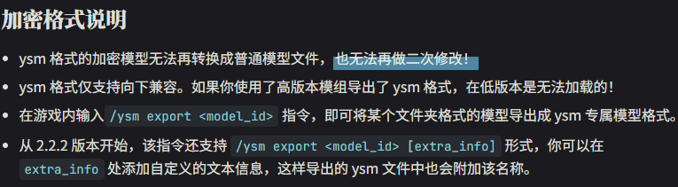

> 出自[YSM文档 - 加密格式说明](https://yesstevemodel.github.io/wiki/type/#%E5%8A%A0%E5%AF%86%E6%A0%BC%E5%BC%8F%E8%AF%B4%E6%98%8E)

那么，这个YSM第三代加密方案是否真的绝对安全？第三代加密使用了哪些算法，哪些技术？从已经预渲染大量必要的信息被擦除的情况下顶点数据恢复原始工程是否可能？

为了探究这些问题，我们的团队展开了研究。

## 初步探索

研究对象为YSM 2.6.4（Forge，Minecraft 1.20.1），可在[modrinth](https://modrinth.com/mod/yes-steve-model/version/2.6.4-forge+mc1.20.1)下载。

使用Recaf反编译之后，经过简单的静态分析，我们可以看出Mod除了有简单的Java混淆并没有其他保护，但初始化逻辑，模型加解密，渲染逻辑均为native方法。从模型的加密文件读取到渲染到画面的过程完全在Native里执行，这意味着将无法通过Hook任何Java方法导出模型的原始工程。

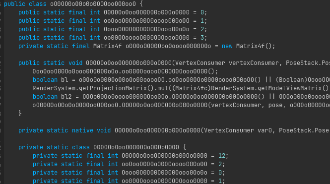

Native分为dll和so对应Windows和Linux版本，均使用了VMProtect 3.9加壳和虚拟化保护。其中加壳就是在通过某些环境检测（例如虚拟机、调试器）检测之后才释放代码段（code segment），虽然释放之后的代码是可转储的，但转储后仍然存在大量系统函数调用隐藏（IAT 加密）、VMP虚拟机代码段、VMP字符串加密、调用约定混淆导致伪代码无法正常生成和程序控制流图（CFG）损坏。所以需要先通过动态调试定位关键代码。

## Native分析

通过x64dbg以运行时附加（attach）方式注入之后会被`VMProtect`的调试器检测到，导致拒绝运行，为规避`VMProtect`内核级反调试，可以选择在Native组件加载完毕后附加，也可以配合[TitanHide](https://github.com/mrexodia/TitanHide)在内核层面隐藏调试器特征。在`CreateFileW`设置条件断点，从模型加载（ysm文件读取）开始追踪得到返回的文件句柄。记录返回的文件句柄后，在`ReadFile`设置条件断点，匹配前述句柄。`ReadFile`返回时取其输出缓冲区地址，设置硬件断点以追踪数据流。得到数据流之后通过断点`memcpy`或`memmove`追踪数据传递，最终即可追踪到实现了加密或解密的函数。

### CityHash

> CityHash是一种[哈希函数](https://zh.wikipedia.org/zh-cn/%E6%95%A3%E5%88%97%E5%87%BD%E6%95%B8)，它主要设计用于字符串哈希，尤其在处理现代 CPU 架构下的**短字符串**时表现极度出色。

```c
/* IDA 生成的C语言伪代码 */
v56 = kMul * ((kMul * (v37 ^ v42)) ^ v37 ^ ((kMul * (v37 ^ v42)) >> 47));
v57 = kMul * ((kMul * (v38 ^ v44)) ^ v38 ^ ((kMul * (v38 ^ v44)) >> 47));
v58 = kMul * (v57 ^ (v57 >> 47)) + v34 - 0x6E50EF7FD354DA5BLL * (v32 ^ (v32 >> 47));
v59 = kMul * (v58 ^ (v43 - 0x21F0911F6424546FLL * (v56 ^ (v56 >> 47))));
v4 = kMul * ((kMul * (v59 ^ v58 ^ (v59 >> 47))) ^ ((kMul * (v59 ^ v58 ^ (v59 >> 47))) >> 47));
```

第一个传入的密码学算法中反复出现`((A * (B ^ C)) >> 47)`特征，与`CityHash`中的`ShiftMix`算法高度吻合，经与[google/cityhash](https://github.com/google/cityhash)官方实现逐段比对，确认YSM版本与标准`CityHash64`的核心差异在于三组常量（`K0`，`K1`，`K2`）与关键函数`Hash128to64`中乘子常量`kMul`的替换，其余控制流与运算逻辑保持一致。

这些常量的作用是用作乘数/加数来随机扩散所有bit。YSM修改了这些常量导致哈希函数映射改变，输入与输出与官方实现不一致，也防止了对于算法的启发式搜索。

```c
// 官方
static const uint64 k0 = 0xc3a5c85c97cb3127ULL;
static const uint64 k1 = 0xb492b66fbe98f273ULL;
static const uint64 k2 = 0x9ae16a3b2f90404fULL;
inline uint64 Hash128to64(const uint128& x) {
    const uint64 kMul = 0x9ddfea08eb382d69ULL;
    uint64 a = (Uint128Low64(x) ^ Uint128High64(x)) * kMul;
    a ^= (a >> 47);
    uint64 b = (Uint128High64(x) ^ a) * kMul;
    b ^= (b >> 47);
    b *= kMul;
    return b;
}
```

```c
// YSM
k0 = 0xE4986A230E5AAA17;
k1 = 0x91AF10802CAB25A5;
k2 = 0xAF29CE778879D9C7;
inline uint64 Hash128to64(const uint128& x) {
    const uint64 kMul = 0xDE0F6EE09BDBAB91uLL; // Modified
    // Algorithm Modified.
    return kMul * ShiftMix(kMul * (ShiftMix((Uint128Low64(x) ^ Uint128High64(x)) * kMul) ^ Uint128Low64(x)));
}
```

分析`CityHash`函数的引用之后，可以看到除了加载模型校验完整性，`CityHash`几乎用在了YSM所有需要校验数据完整性的地方，例如通讯、缓存验证。每个用途都有不同的种子，可以通过查到对应的引用看到。

```cpp
0xD017CBBA7B5D3581  // MT19937 种子派生
0xA62B1A2C43842BC3  // XChaCha20 状态初始化
0xD1C3D1D13A99752B  // 服务端缓存解密
0x9E5599DB80C67C29  // 文件完整性校验
0xEE6FA63D570BD77B  // 网络包校验
0xF346451E53A22261  // 缓存完整性校验
```

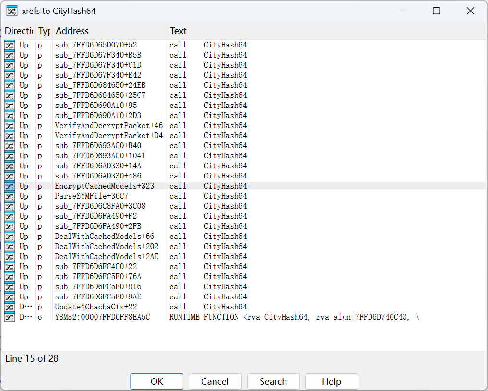

### Key和IV (Initialization Vector)与校验

`.ysm`文件末尾有64字节的额外数据，经过分析，前32字节为加密Key，在后续的所有密码学算法中都有使用，接下来24字节为IV，用于随机化密文，后面的所有密码学算法也有使用，最后 8 字节是文件中除该 64 字节尾部数据外其余部分的CityHash64结果（种子为`0x9E5599DB80C67C29`），用于第一步的完整性验证。

验证文件完整性之后，取出Key和IV，传入后续的密码学函数。

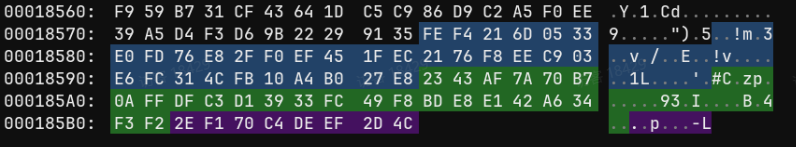

### XChaCha20

> XChaCha20 是 ChaCha20 流密码的一个变体，其核心改进在于将原本 64 位的 **Nonce（临时随机数）** 扩展到了 **192 位**。

在验证之后，数据将会使用`XChaCha20`解密，YSM对`XChacha20`的加密解密流程进行了修改。

首先通过`10 * (hash % 3) + 10 (= 10/20/30)`算出10/20/30轮数，然后通过`((hash & 0x3F) | 0x40) << 6`算出块大小。每处理完一个数据块后，不再继续使用原ChaCha上下文，而是对当前已解密块计算`CityHash`，用这个Hash结果，并重新计算出下一块的轮数和块大小，并更新`ChaCha`上下文，使每个块的解密参数依赖于前序块的明文摘要。

这种链式解密一定程度上提高了攻击成本，但是由于所有过程均在一个循环中完成，抗逆向效果有限。

#### 伪代码

```python
def xchacha_update_state(ctx: XChaChaCtx, hash_v: int):
    hash_v &= 0xffffffffffffffff
    ctx.rounds = 10 * (hash_v % 3) + 10
    lo = hash_v & 0xffffffff
    hi = (hash_v >> 32) & 0xffffffff
    for i in range(4, 16, 1):
        if i % 2 == 0:
            ctx.input[i] ^= lo
        else:
            ctx.input[i] ^= hi
    return ((hash_v & 0x3f) | 0x40) << 6
    

def YSMChaCha(data: bytes, key: bytes, iv: bytes):
    # 获得第一轮
    hash = CityHash64(key + iv) # 种子为0xA62B1A2C43842BC3
    next_round_size = (hash & 0x3f | 0x40) << 6
    blockPointer = 0
    
    # Setup
    ctx = XChaChaCtx()
    result = bytearray()
    xchacha_keysetup(ctx, key, iv)

    # 解密循环
    while blockPointer < len(data):
        if blockPointer + next_round_size > len(data):
            next_round_size = len(data) - blockPointer

        enc1 = data[blockPointer:blockPointer + next_round_size]
        blockPointer += next_round_size

        dec1 = xchacha_decrypt_bytes(ctx, enc1)
        
        # 解密之后明文，确定下一次解密状态
        res_hash = CityHash64(dec1) # 种子为0xA62B1A2C43842BC3
        next_round_size = xchacha_update_state(ctx, res_hash)

        result += bytearray(dec1)
    return bytes(result)
```

### MT19937 XOR

XChaCha20解密完成后，解密的数据传入下一个密码学函数 —— `MT19937_64`流密钥异或。使用标准 `std::mt19937_64`（64 位 Mersenne Twister）PRNG算法生成流密码。

种子由 `Key || IV`（56 字节）经 CityHash64（种子`0xD017CBBA7B5D3581`）计算得到。每轮从 MT19937取 8 字节流密钥（小端序），与 `XChaCha20`解密结果逐字节异或。

MT19937异或后的数据头部前2字节构成一个小端16位整数，经按位与`0x3FF`掩码后得到 `Nonce`长度 `n`（最大 `1023`）。跳过` 2 + n `字节后，剩余部分为最终压缩数据。YSM 在模型、通信报文及缓存加密的实现中，统一采用随机字节填充头部的方案。该策略有效消除了在 `Key` 与 `IV` 固定的极端情况下，因明文相同而导致密文一致的特征，显著增强了抗重放与抗模式分析的能力。

#### 伪代码

```c++
// 拷贝Key和IV
std::vector<uint8_t> key_iv(56);
std::memcpy(key_iv.data(), key, 32);
std::memcpy(key_iv.data() + 32, iv, 24);

// 计算种子: CityHash64(Key || IV)，Seed为0xD017CBBA7B5D3581
uint64_t seed = CityHash64(reinterpret_cast<const char*>(key_iv.data()), key_iv.size(),0xD017CBBA7B5D3581);

// 初始化标准 MT19937-64
std::mt19937_64 mt(seed);
std::vector<uint8_t> result(data.size());

for (size_t i = 0; i < data.size(); ++i) {
    if (i % 8 == 0) {
        uint64_t rnd = mt();  // 取 8 字节随机数
        for (int j = 0; j < 8 && i + j < data.size(); ++j) {
            result[i + j] = data[i + j] ^ ((rnd >> (j * 8)) & 0xFF);
        }
    }
}
```

### Zstd

MT19937解密之后，数据传到了下一个处理流程，可以清晰的看到其特征`0xFD2FB528`，也就是ZSTD压缩算法的头部Magic Number。

```c
/* IDA 生成的C语言伪代码 */
if ( *(_DWORD *)src != 0xFD2FB528 ){
        n8_1 = 0xFFFFFFFFFFFFFFF6uLL;
        if ( (*(_DWORD *)src & 0xFFFFFFF0) != 0x184D2A50 )
          goto LABEL_36;
        n8_1 = 8;
        if ( srcSize < 8 )
          goto LABEL_36;
        zfhPtr->frameContentSize = *((unsigned int *)src + 1);
        zfhPtr->frameType = ZSTD_skippableFrame;
LABEL_35:
        n8_1 = 0;
        goto LABEL_36;
}
```

解析到Zstd头部之后，传递到了解析块信息方法，但是这个方法也并非标准的Zstd实现。

对于block_header，YSM进行了重新排列，格式和官方版本差距很大，并且使用异或加密了块大小，而加密的块大小也是从前后两段拼起来的。

```c
// block_header格式

// 官方
bit 0:    lastBlock
bit 1-2:  blockType
bit 3+:   blockSize

// YSM
bit 7:    lastBlock
bit 5-6:  blockType
bit 0-4 + 高 8 位: blockSize

// 块大小解析

// 官方
cSize = blockHeader >> 3

// YSM
cSize = ((blockHeader & 0x1F) << 16) | (blockHeader >> 8)) ^ 0xD4E9

// === 官方 ZSTD_getcBlockSize ===
static size_t ZSTD_getcBlockSize(const void* src, size_t srcSize,
                                  blockProperties_t* bpPtr) {
    U32 cBlockHeader = MEM_readLE24(src);
    bpPtr->lastBlock = cBlockHeader & 1;
    bpPtr->blockType = (cBlockHeader >> 1) & 3;
    bpPtr->origSize = (cBlockHeader >> 3) & 0x1FFFFF;
    return cBlockHeader >> 3;
}

// === YSM ZSTD_getcBlockSize ===
static size_t ZSTD_getcBlockSize(const void* src, size_t srcSize,
                                  blockProperties_t* bpPtr) {
    U32 cBlockHeader = MEM_readLE24(src);
    bpPtr->lastBlock = (cBlockHeader >> 7) & 1;          // bit 7
    bpPtr->blockType = (cBlockHeader >> 5) & 3;          // bit 5-6
    bpPtr->origSize = (cBlockHeader & 0x1F) << 16 | (cBlockHeader >> 8) ^ 0xD4E9;
    return ((cBlockHeader & 0x1F) << 16) | (cBlockHeader >> 8) ^ 0xD4E9;
}
```

同时还对块类型的Opcode进行了重排序，会导致官方的Zstd错误的识别指令，导致解压过程输出大量错误的数据或未解压数据。

| Opcode | 标准指令 | YSM 指令 |
|:------:|---------|---------|
| `0` | `bt_raw`（原样拷贝） | `bt_compressed`（压缩块） |
| `1` | `bt_rle`（行程编码） | `bt_rle`（行程编码） |
| `2` | `bt_compressed`（压缩块） | `bt_reserved`（保留） |
| `3` | `bt_reserved`（保留） | `bt_raw`（原样拷贝） |

按照YSM的语义完成修改之后，终于成功解压，得到了未压缩的数据。

## 反序列化

在完成了解密和解压之后，虽然数据看上去是明文，但是并没有变成任何有效的格式或者`Blockbench`工程。

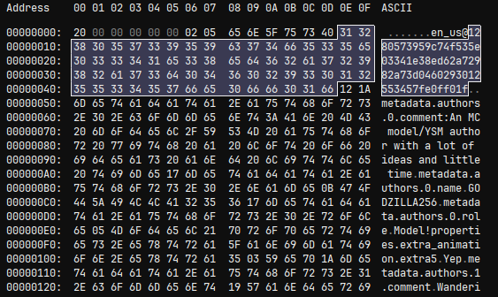

> 解压之后的数据

很显然这就是YSM最终的定制格式也就是一套自定义的对象序列化流，在Native中内部消费，甚至不会落到JVM，但是对比多个模型的数据后发现，第一个解密的Header`20`也不是魔数而是格式版本，因为这个数字与模型发布时间相关，越新的模型使用的YSM版本越高，也就是导出的格式版本越高。

在对比了从YSM的Discord中下载的大量模型之后，我们初步将这个版本号划定了两个分水岭把版本号分成了三段，也就是进行了两次大型更改，两次大型更改几乎都是重写了这套格式。

### 数据消费

摊开一个文件，可以看到有很多`0x04`、`0x07`这样的小字节来表达字符串长度，但是字符串长度超过127时，前字节的高位则是1，这是VarInt的模式，说明YSM的消费模式极有可能参考自Minecraft的PacketBuffer中对于ByteBuf的消费模式，在更多分析后，发现其读取模式中实现了四种基础数据类型为VarInt， VarLong，VarString（UTF-8），ByteArray都和Mojang在FriendlyByteBuf/PacketBuffer中的实现一致。

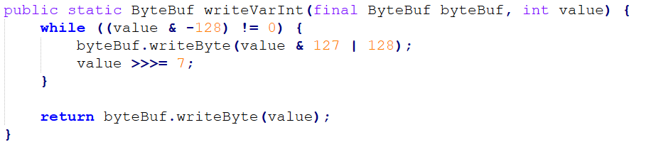

> Minecraft协议中的写入VarInt方法

### format < 4 第一代格式

第一代格式是一个突破口，因为YSM刚刚经历了上一代AES加密的攻击风波，大量的模型被解密，这些被解密的模型的作者紧急迁移到了最新的Native加密，这导致我们获得了很多旧格式和新格式对应的样本，为分析创造了极其有利的条件。

结合对Native的调试并从一个样本入手，在读取到format之后进入了消费流程，第一个值为一个VarInt，这个值后面则是一段空字节，而这个值就是空字节的长度，这个设计令人费解，我们初步理解为某种混淆性的保留，我们将这一段称为`SkipPrefix`。

观察接下来的数据，多个同样的结构：一个整数N，然后是N段重复的结构，这是一段长度前缀的数组，Minecraft协议中很多包也有类似的编码模式。每组以一段字符串开头（为一个内部ID或名字），中间夹一个0x01，然后是一个JsonElement，经过和明文模型对比，可以得出这就是模型的json数据。

比较特殊的是第三段，虽然可以看出是图片因为有PNG头，但是并不是原始的PNG，而是一个RGBA像素流，对应各个像素的颜色，而后面则是Width和Height，解码时需要按照Width和Height重新拼接。

这样的长度前缀的数组有六组，经过对比最终完全探明格式：

```
SkipPrefix Length (Varint) + SkipPrefix
→ ModelCount → [ModelId + Marker(1) + Model] × N
→ AnimationCount → [AnimationId + Marker + Animation] × N
→ TextureCount → [TextureName + RGBA_Bytes + Width + Height] × N
→ ModelTable:     [ModelId → ModelHash]     × N
→ AnimationTable: [AnimationId → AnimationHash] × N
→ TextureTable:   [TextureName → TextureHash]   × N
```

后三个为内部ID或名字对应到SHA256的一个表，对照.ysm文件头部（被称为`YSGPHeader`）的Source SHA-256清单可以发现：清单中给出的资源路径是按SHA-256索引的，这个对照表提供了一个将资源恢复到原始文件名的对照表，按照这个对照表进行提取即可还原到Blockbench工程文件。

>  事实上解析并不需要这个YSGPHeader，因为在我们的后续分析中，服务器下发的模型并没有YSGPHeader。

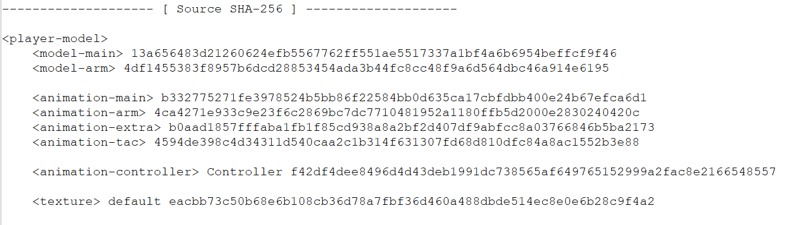

> YSM文件头部的Source SHA-256表

### format 5-14 第二代格式

这一代和第一代的整体结构差异*不大*，但是在各个版本之间都有不同，例如format9添加了动画控制器和音效结构，法线，高光等信息，在按照第一版本的结构简单扩展之后，即可完成解析。

结构上额外新增了Metadata（我们称其为`YSMJson`）字段，包含作者信息等数据。经过对于多个中间版本的分析，最终得出一份通用的格式：

```
SkipPrefixLen + SkipPrefix
Models           × N    [id + marker + body]
Animations       × N    [id + marker + body]
[format > 9] AnimationControllers × N + Table
Textures         × N    [name + mainImage + subTextures]
[format > 9] Sounds × N + Table
ExtraTextures    × N    [avatarName + RGBA + W + H]
ModelTable       × N
AnimationTable   × N
TextureTable     × N    (含 specialTextureHash)
YSMJson
```

### format 15+ 第三代格式

第三代格式中，资源块出现的顺序整个重新排序了，这是一次完全的重构：音频与脚本文件被提到了最前面，模型反而被排到了末尾。资源对象不再依赖后置映射表来与SHA-256关联，而是自带sha256字段。并引入了多个新的资源类型例如SubEntities（载具，投掷物等），而在版本26中载具和投掷物贴图的布局也有了拆分。

经过一些调试和分析，我们得出了最新的第三代的通用格式：

```
SoundFiles:    [name + hash + bytes] × N
FunctionFiles: [name + hash + bytes] × N
LanguageFiles: [name + hash + nodeCount + key-value-pairs] × N
→ SubEntities × N (format < 26: 统一列表; format ≥ 26: Vehicles + Projectiles 拆分)
→ Sentinel(1)
→ Animations × N
→ AnimationControllers × N
→ TextureFiles × N (+ subTextures)
→ Models × N
→ YSMJson
```

这一代格式中，信息，动作，以及文件映射都储存在了YSMJson中，其中文件映射对我们的还原工作有极大的帮助，可以帮助我们轻松的还原出模型的工程结构。

```json
{
  "player": {
    "model": {
      "main": "models/main.json",
      "arm": "models/arm.json"
    },
    "animation": {
      "main": "animations/main.animation.json",
      "arm": "animations/arm.animation.json",
      "extra": "animations/extra.animation.json",
      "tac": "animations/tac.animation.json"
    },
    "animation_controllers": [
      "controller/Controller.json"
    ],
    "texture": [
      {
        "uv": "textures/default.png"
      }
    ]
  }
}
```

## 反渲染

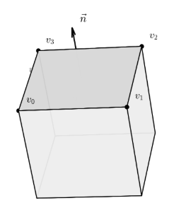第三代格式中，有一个非常令人困惑的问题，第三代提取的模型中，Blockbench工程的origin、size、pivot、rotation，各面的UV框一个都没有，只有原始的顶点坐标、法线和必要的UV。

这代表了在新版本YSM中，导出阶段就已对模型进行了预渲染，将Blockbench工程预渲染成了纯几何数据。换句话说，加密侧完全擦除了工程文件层结构信息，使得即便完成所有反序列化，导出的模型也只是糊成一团的顶点，无法在Blockbench中还原为可编辑的工程，这也成为了保护模型的最终手段。

我们可以得到的信息只有：每个面带一个法线 $\vec{n}$、四个顶点 $v_0， v_1， v_2， v_3$ 以及它们的 UV 坐标。而这些文件远不足恢复Blockbench工程。

事情的转机出现在了Blockbench模型的一个特性：Blockbench的立方体并不是任意网格，它有非常强的几何约束

- 每个立方体的局部坐标系下是轴对齐的;
- 立方体整体可以绕中心做三轴旋转，旋转后6个面的法线在世界坐标系下变成立方体局部坐标系的三个基向量及其反向
- 每个面的UV是纹理空间中的一个矩形，且矩形的两条边分别对应该面在局部坐标系下的两个切向

这些特性为根据顶点重建整个模型提供了可能性，于是我们展开了反渲染算法设计。

### 恢复旋转（Rotation）

我们第一个入手点是恢复各个面对应的立方体的Rotation（旋转）。

要恢复一个被旋转过的立方体，首先得知道它的朝向（Facing），也就是在3D世界空间中它的局部旋转各自指向的位置（Position）。法线已经可以确定一组方向，但以法线为轴旋转的角度仍然无法确定。然而Blockbench的特性是纹理坐标的UV方向必然平行于面的某两条边。也就是在UV矩形里，只有一条边的 $u$ 在变、$v$ 不变(底边)，这条边在3D世界空间的方向，就是该面的U切向 $\vec{T_u}$，同理，只有 $v$ 在变、$u$ 不变的边对应V切向 $\vec{T_v}$。

只要遍历每个面的四条相邻边，就能根据它们UV差值的形态判断这条边对应世界空间中的哪个方向，从而提取出该面的两个切向。这样，每个面就可以推导出三个独立的方向：法线、U切向、V切向。

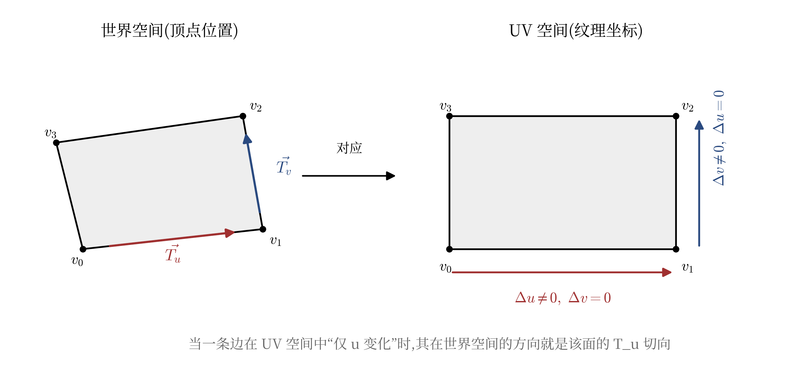

> 左边是3D世界空间中倾斜的一个面，右边是它在纹理上对应的矩形。

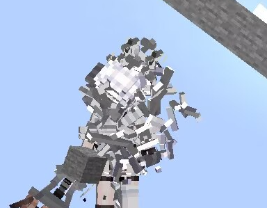得到所有面的射线之后，简单通过相似度分析去重之后，我们可以得到三个方向，这就是立方体的三个局部轴。然而YSM作者出于某种原因将所有原始的Double都精度降级为了Float（包括所有Function框架里的也改了），导出预渲染出来的模型中的所有浮点精度会丢失，提取出的三个方向往往不完全正确，直接拿它们来计算会有误差，经过几次Transform后误差会被指数级的放大导致模型直接崩坏。

解决办法是使用[Gram-Schmidt正交化](https://en.wikipedia.org/wiki/Gram%E2%80%93Schmidt_process)。选取第一个方向作标准，把第二个方向里和它平行的成分去掉，剩下的就和它严格垂直了，第三个方向更简单，前两个叉乘一下就是。

处理完得到的三个方向就构成了正确的旋转。

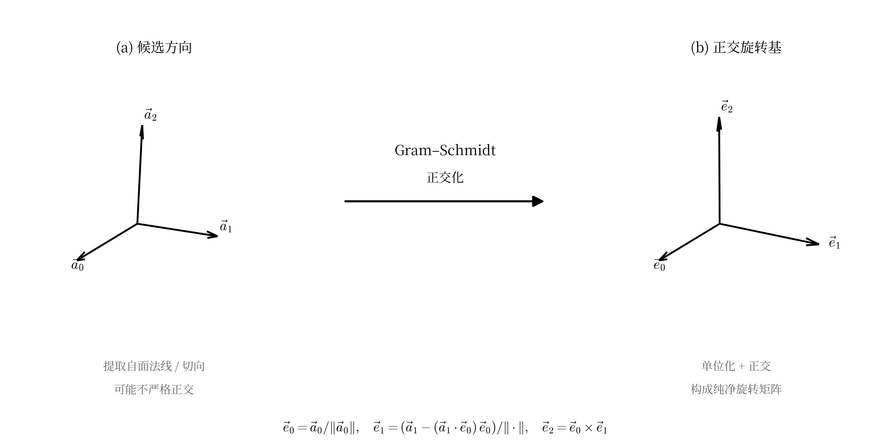

> Gram-Schmidt修复浮点精度

这里引入了几个新的问题，**三个方向对应的分别哪个是XYZ？符号是什么？**

这确实是棘手的问题，但是很快我们找到了突破口，也就是Blockbench源码的[cube.js](https://github.com/JannisX11/blockbench/blob/master/js/outliner/types/cube.js)。

```js
scope.faces.north.uv = calcAutoUV('north', [0, 1], [1, 1]);
scope.faces.east.uv =  calcAutoUV('east',  [2, 1], [1, 1]);
scope.faces.south.uv = calcAutoUV('south', [0, 1], [-1, 1]);
scope.faces.west.uv =  calcAutoUV('west',  [2, 1], [-1, 1]);
scope.faces.up.uv =	   calcAutoUV('up',	   [0, 2], [-1, -1]);
scope.faces.down.uv =  calcAutoUV('down',  [0, 2], [-1, 1]);
```

> js/outliner/types/cube.js

calcAutoUV的参数指定该面在UV空间下对应什么朝向（Facing），轴(0=X， 1=Y， 2=Z)，第二组参数给出方向正负号。并在`CubeFace.UVToLocal()`渲染时把UV坐标插值回三维顶点位置，示例：

```js
if (this.direction == 'east') {
    vector.x = to[0];
    vector.y = Math.lerp(to[1], from[1], lerp_y);   // V 增大 → Y 减小
    vector.z = Math.lerp(to[2], from[2], lerp_x);   // U 增大 → Z 减小
}
```

把这六个面代码整理出来，我们就得到了立方体每个面的UV方向表反查方案：

```cpp
static void get_expected_uv_dirs(Vector3D local_normal, Vector3D& exp_U, Vector3D& exp_V) {
    Vector3D n = round_vec(local_normal);
    if (n.x == -1) { exp_U = { 0, 0, 1 };  exp_V = { 0, -1, 0 }; return; }
    if (n.x ==  1) { exp_U = { 0, 0,-1 };  exp_V = { 0, -1, 0 }; return; }
    if (n.y ==  1) { exp_U = {-1, 0, 0 };  exp_V = { 0,  0,-1 }; return; }
    if (n.y == -1) { exp_U = {-1, 0, 0 };  exp_V = { 0,  0, 1 }; return; }
    if (n.z == -1) { exp_U = {-1, 0, 0 };  exp_V = { 0, -1, 0 }; return; }
    if (n.z ==  1) { exp_U = { 1, 0, 0 };  exp_V = { 0, -1, 0 }; return; }
}
```

最简单的方案就是逐个计算并打分，6种排列x8种符号组合=48种候选，分别生成这48个方案的Transform结果，对所有所有面的UV切向与Blockbench规范方向的吻合程度对比打分，取得分最高的那个。

至此，我们成功完全恢复了立方体的旋转。

### 恢复碰撞箱（Axis Aligned Bounding Box）

旋转$R$确定后，我们就获得了足够的条件推导碰撞箱，把3D世界空间中倾斜的顶点变换回局部空间。

3D世界空间里的顶点是可以任何方式分布的，即便我们知道这是一个立方体，也无法直接在3D世界空间里确定他的边界。但只要把每个顶点 $\vec{p}$ 用 $R^\top$ 反推，就能把它恢复到未旋转状态，在未旋转的局部状态下，所有顶点都恢复到轴对齐状态。

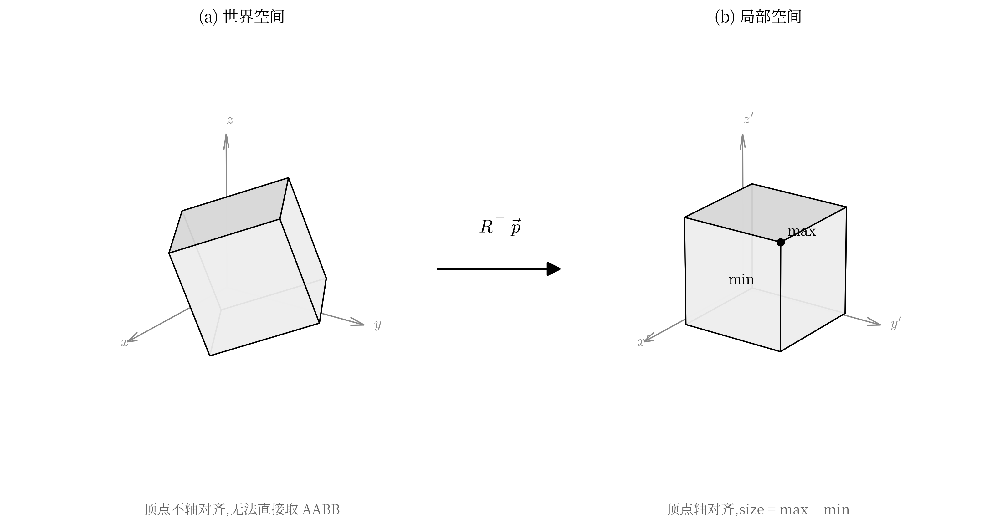
> transform世界到局部碰撞箱

然后问题就简单了，在三个轴上分别取最小和最大`Position(minXYZ， maxXYZ)`，就可以得到碰撞箱，然后再拿到这个碰撞箱的中点，再用旋转$R$来Transform回去就能反推得到原始Blockbench工程中的`pivot`。把旋转矩阵分解为欧拉角，就得到了原始Blockbench工程的`rotation`字段，最后的`origin`由`pivot`减去`size`的一半得到。

### 恢复所有UV

Blockbench中每个面的`uv`字段是一个起点加一个尺寸:`{u, v, u_size, v_size}`，在纹理图上框出一块矩形。

在用$R^\top$算出法线的局部空间之后，只需看它在哪个轴上最贴合，就能判断它属于哪一面，从而把读到的UV数据写到对应面。剩下的就是把该面的四个 UV 顶点拟合成矩形。取`min/max`然后将UV写回去即可。

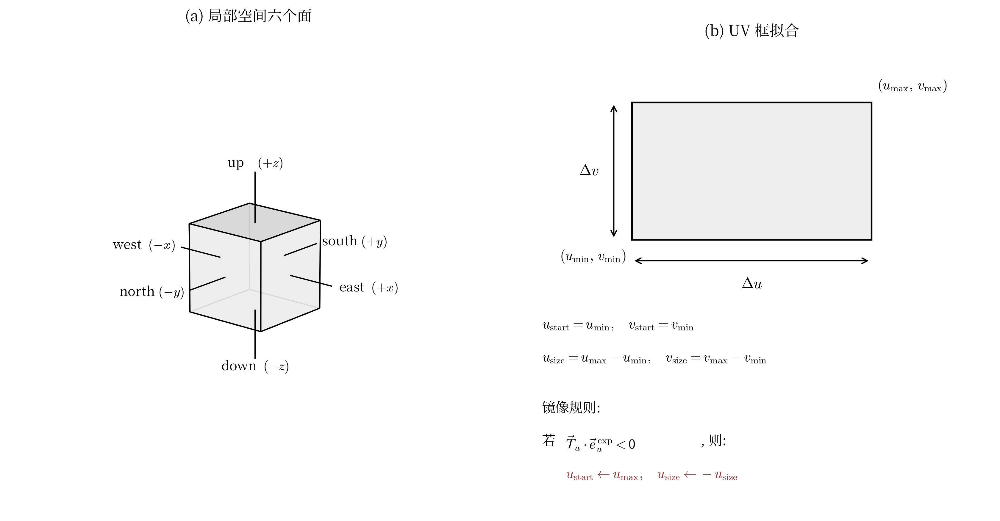

> 这里方向定义因坐标系约定不同，实际实现中可能与图示有出入

### 完成恢复

现在我们获得了所有恢复必要的数据：`origin`、`size`、`pivot`、`rotation`，各面的UV，但是要让他可以被Blockbench识别，还需要把它装回Json里。在写回过程发现YSM内部使用的坐标系与Blockbench不完全一致，X 轴方向相反，且旋转的存储单位是弧度，这导致如果直接原样写回渲染就会崩坏。

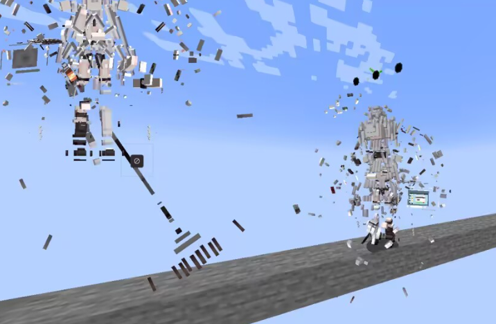

所以需要进行一个简单转换

```cpp
b_json["pivot"] = { -parsedBone.pivot.x, parsedBone.pivot.y, parsedBone.pivot.z };
Vector3D rot = { -rad2deg(parsedBone.rotation.x),
                 -rad2deg(parsedBone.rotation.y),
                 +rad2deg(parsedBone.rotation.z) };
```

在进行简单转换之后，得出了标准的Blockbench立方体Json：

```json
{
  "origin":   [-4.0, 0.0, -4.0],
  "size":     [8.0, 8.0, 8.0],
  "pivot":    [0.0, 4.0, 0.0],
  "rotation": [0.0, 30.0, 0.0],
  "uv": {
    "north": { "uv": [16, 8],  "uv_size": [8, 8] },
    "east":  { "uv": [0, 8],   "uv_size": [8, 8] },
    "south": { "uv": [24, 8],  "uv_size": [8, 8] },
    "west":  { "uv": [8, 8],   "uv_size": [8, 8] },
    "up":    { "uv": [8, 0],   "uv_size": [8, 8] },
    "down":  { "uv": [16, 0],  "uv_size": [8, 8] }
  }
}
```

最终我们根据YSMJson里的文件结构，写出所有文件，打开Blockbench测试：

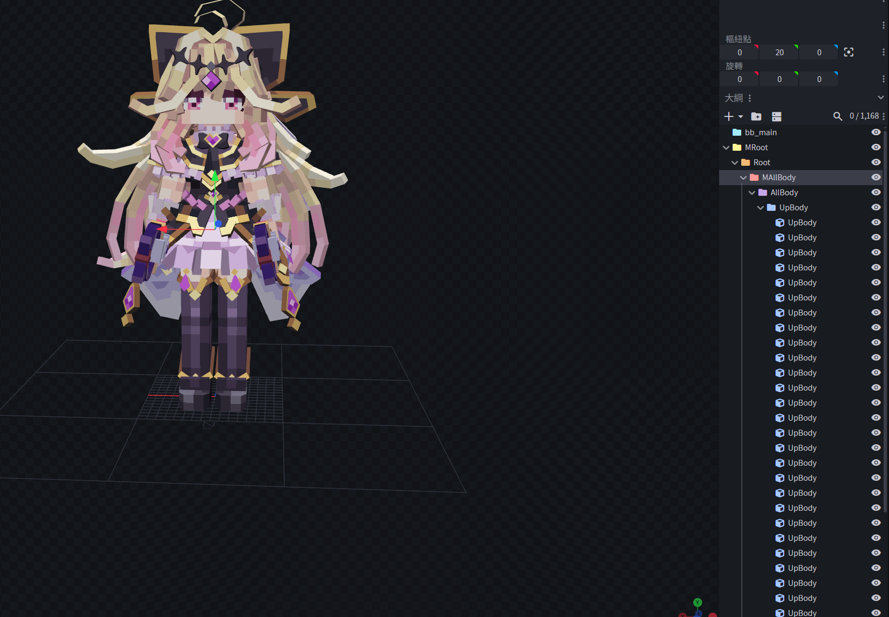

> 成功解析，模型正确，贴图正确，结构清晰

至此，即便是YSM第三代格式中预渲染后的纯几何顶点，也可以被还原为可在Blockbench中正常打开、编辑、再导出的标准工程文件。这意味着YSM的完全编译，无原始工程方案在数学上并非不可逆，我们通过这套反渲染算法，成功还原了渲染成一团的顶点数据到工程。

## 历史版本

现在我们已经成功解密了V3的全套格式，然而，YSM 加密并非一蹴而就，而是历经了长期的演进与优化。

在V3之前，还有V1和V2两代格式，但是V1与V2时期的YSM早已被彻底攻破，模型直接被批量解密泄露，这也是YSM作者最终决定开源V1时代代码，并在1.2.0版本起把整个加密链路重写到Native层的直接原因。

如果我们要覆盖所有版本的解密方案，这些历史版本也是有研究的必要的，通过文件头特征可以快速判断版本归属。三代格式都以YSGP这个magic number开头(`0x50475359`)，但V1和V2直接放在文件偏移0，而V3在前面加了一个UTF-8 BOM(`EF BB BF`)，让YSGP出现在偏移3。YSGP 之后紧跟一个4字节大端整数标识crypto版本，1、2、3 分别对应 V1、V2、V3。

### V1 早期第一版加密

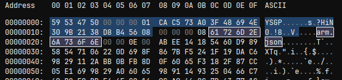

> 第一代YSGPHeader

V1的结构相当简单。文件头部8字节用来声明magic与crypto版本，接着16字节是一个AES-128密钥，但是出于某种原因没有使用因为每个资源都有自己的加密密钥。再后面是资源条目大全，每个条目前面资源名、加密数据长度、AES Key、AES IV，然后是AES-CBC加密的zlib压缩数据。

经过简单的分析即可探明结构：

```
Header (24 bytes)
  Magic            (4 bytes, uint32_le)   — "YSGP" (0x50475359)
  Crypto Version   (4 bytes, uint32_be)   — 1
  AES Key          (16 bytes)             — unused

Resources
  for each resource:
    NameLen        (4 bytes, uint32_be)
    FileName       (NameLen bytes)
    DataLen        (4 bytes, uint32_be)
    AES Key        (16 bytes)             — AES Key
    IV             (16 bytes)             — AES-CBC IV
    EncryptedData  (DataLen bytes)        — Zlib Data
```

每个文件都有自己的密钥，但是这两个字段都是明文写在条目里的，意味着解密这个资源只需要从读出Key和IV，然后使用标准的AES，就解密了，然后zlib解压，按照文件名解码写出即可。

随着社区解密方案的迅速发布，YSM 作者察觉到 V1 版已被完全破解。**索性顺水推舟**，将 V1 源码以 **[LegacyYSM](https://github.com/YesSteveModel/LgeacyYSM)** 之名正式开源。

### V2 早期第二版加密

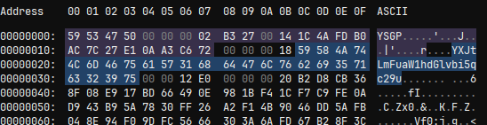

> 第二代YSGPHeader，可以看到条目名字已经使用Base64编码

V2其实和V1结构是差不多的，但是其密钥不再写死在文件里，而是有了派生方案，放一个32字节的EncryptedKey，这是经过派生密钥加密之后的真实密钥。要解密资源，需要先求出派生密钥，再用派生密钥解出真实密钥，最后才能解密资源数据。

派生流程为：
```
EncryptedData
  → MD5
  → 后8字节，大端为long
  → JavaRandom(seed).nextBytes(16) 生成RandomKey 
```

由于在任何不安全随机数只要你知道随机种子都是可以预测的，所以输入同样的种子会得到同样的随机数，所以这个RandomKey其实是可以预测的，使用RandomKey解密EncryptedKey即可得出原始Key，即可解密资源，在这个版本，资源条目名字使用Base64编码而不是明文，解密写出即可。

结构和V1差异不大，也是很容易探明：

```
Header (24 bytes)
  Magic            (4 bytes, uint32_le)   — "YSGP" (0x50475359)
  Crypto Version   (4 bytes, uint32_be)   — 2
  AES Key          (16 bytes)             — unused

Resources (重复至文件结束)
  for each resource:
    NameLen        (4 bytes, uint32_be)
    FileName       (NameLen bytes, Base64 String)
    DataLen        (4 bytes, uint32_be)
    EncKeyLen      (4 bytes, uint32_be)   ← V2 新增，固定为 0x20 (32)
    EncryptedKey   (32 bytes)             ← V2 新增，需经派生链解密才能得到 RealKey
    IV             (16 bytes)             — AES-CBC IV
    EncryptedData  (DataLen bytes)        — Zlib Data
```

至此我们已经成功分析了YSM V1 V2 V3 (及全部子格式)的加密手段，并且有恢复到原始Blockbench工程的方案。

## 网络协议分析

如果只看.ysm文件的解密，我们其实只看到了YSM安全机制的一半。单纯解密本地ysm文件还不够，因为有些模型只在服务端有，下发给客户端的只有一个加密的cache文件且和并非我们之前谈到的加密流程。

YSM的网络通讯系统基于CustomPayload（C17/S3F），我们可以通过在NetworkManager中的Netty通道中注册一个自定义Handler，直接得到Packet的Object，也就可以得到Packet的原始数据。

观察进入服务器之后服务端发来的第一个包，发现也是加密的，它的密钥必须是已知的，否则通讯无法建立。从服务端的writePacket部分打断点，可以一路追踪到Native方法，从中可以看到一个56字节的硬编码常量：

```cpp
{
    0x0F, 0xC7, 0x7E, 0xF3, 0xF4, 0xB8, 0x35, 0x3A,
    0xA2, 0xBA, 0x7F, 0xD3, 0x17, 0x79, 0x46, 0x8E,
    0x65, 0x42, 0xD0, 0x98, 0x8A, 0x9B, 0xB0, 0x19,
    0x80, 0x4F, 0x81, 0x56, 0x36, 0x6A, 0x12, 0x62,
    0xBE, 0x0E, 0xE5, 0xAD, 0x47, 0x01, 0xD4, 0x5E,
    0xE4, 0xEB, 0xFB, 0x36, 0xCB, 0x47, 0x42, 0x98,
    0xF9, 0xE5, 0x7A, 0x5C, 0x3C, 0xDB, 0x2C, 0x76
};
```

56字节正好是之前的加密流程中的XChaCha20所需的32字节Key加24字节IV，也就是极有可能这个地方的加密也复用了模型解密的XChaCha20+MT19937 XOR流水线，解密之后得到了一个PacketId+56字节的密钥的结构，PacketId为0x01，这个就是S2C的密钥，这个密钥使用同样的流程解密客户端的回复，就可以得到PacketId 0x02和一个56字节密钥，这是C2S的密钥，之后所有通讯各走各的密钥来加密，流程仍然是这一套。

### 服务端模型下发

走完握手和密钥交换流程之后，客户端会向服务端请求模型(PacketId 0x04)，服务端通过 Packetd 5分片回传。这一对包的结构相对常规，uuid索引模型，然后按chunk切片，带上偏移量和长度，客户端按偏移量拼回完整文件并且存为cache文件。

但是这个拼接出来的文件看起来也是加密的而非明文，查看Packet Log，PacketId 0x03中又进行了一次密钥对下发（我们称之为`ServerCacheKey`和`ClientCacheKey`），观察后发现，服务端下发的模型数据和落地的`chache`文件其实不一样，虽然它们都是用`ServerCacheKey`加密的，但是客户端收到模型密文后，会先用`ServerCacheKey`解出明文，再用`ClientCacheKey`重新加密一遍才落盘。

仔细思考一下，这看似迷惑的操作其实是一种反拷贝措施。`ServerCacheKey`在每次会话中由服务端控制，`ClientCacheKey`是某个客户端专用的，两者都不会直接出现在硬盘上。cache文件里只有用`ClientCacheKey`加密过的密文，而`ClientCacheKey`是逻辑上绑定到客户端的，服务器验证某些东西验证至少是同一个客户端之后才会下发。就算有人把cache文件完整拷贝到另一台机器，没有同一个客户端的`ClientCacheKey`，这些文件就无法解密。

再回到服务器下发的模型本身，再使用`ClientCacheKey`解密之后，即可得出明文，结构和标准的加密YSM无异，只是没有`YSGPHeader`，但是这个不是必要的，复用前面的解密流程，即可完成解密服务端模型。

## 研究成果

至此，我们完成了对YSM三代加密格式与网络通讯协议的完整逆向。

我们的还原方案覆盖了YSM自项目诞生以来的全部加密格式：V1(标准 AES-CBC + zlib)、V2(增加 MD5 + JavaRandom 派生层)、以及 V3 全部子版本(`format < 4`、`4 ≤ format ≤ 15`、`format > 15`)。任意一份历史或当前的.ysm件我们都可以处理。

针对YSM第三代中模型被预渲染为纯顶点、工程层结构被完全擦除的情况，我们设计并一套链式推导方案，从只剩法线、顶点位置和UV的数据中恢复出origin、size、pivot、rotation与六面UV框，导出可在Blockbench中正常打开、编辑、再导出的标准工程。这意味着YSM的完全编译、无原始工程的保护技术在数学上并非不可逆。

我们梳理了YSM的Custom Payload通道协议，还原了硬编码引导密钥、会话密钥握手、Packet 1~5的作用，并解开了ServerCacheKey/ClientCacheKey双层加密实现了对客户端本地缓存的复制保护这条链路的。还原意味着，我们不仅能解密本地文件，也能截获并解密所有服务端按需下发的模型。

基于上述全部研究成果，本团队实现并开源了我们的项目：**YSMParser**——独立的YSM文件解析器，从加密`.ysm`文件出发，完整执行解密、解压、反序列化、反渲染、Json装配的全流程，输出Blockbench工程目录。